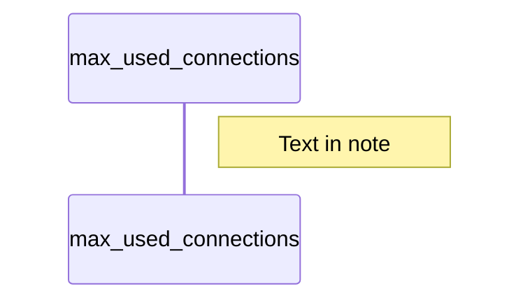

# MDEV-30543 max_used_connections_time
- [Link](https://jira.mariadb.org/browse/MDEV-30543)
- 
## MySQL implementation


### Max_used_connections status var in MySQl

- [MySQL max_used_connections](https://dev.mysql.com/doc/refman/8.0/en/server-status-variables.html#statvar_Max_used_connections), it should be default 1, 0, or -1.

- Implementation
  - Define (`mysqld.cc`)
```C
{"Max_used_connections",
     (char *)&Connection_handler_manager::max_used_connections, SHOW_LONG,
     SHOW_SCOPE_GLOBAL},
```
- Set in [connection handler](https://github.com/mysql/mysql-server/blob/8.0/sql/conn_handler/connection_handler_manager.cc#L55) in function `check_and_incr_conn_count` if number of connections is greater
than this variable (default is 0, check code)
  - Assign:
```C
bool Connection_handler_manager::check_and_incr_conn_count(bool is_admin_connection) {
  bool connection_accepted = true;
  mysql_mutex_lock(&LOCK_connection_count);
  /*
    Here we allow max_connections + 1 clients to connect
    (by checking before we increment by 1).
    The last connection is reserved for SUPER users. This is
    checked later during authentication where valid_connection_count()
    is called for non-SUPER users only.
  */
  if (connection_count > max_connections && !is_admin_connection) {
    connection_accepted = false;
    m_connection_errors_max_connection++;
  } else {
    ++connection_count;

    if (connection_count > max_used_connections) {
      max_used_connections = connection_count; // Anel: since connection_count always > max_used_connections
      max_used_connections_time = time(nullptr);
    }
  }
  mysql_mutex_unlock(&LOCK_connection_count);
  return connection_accepted;
}
```


### Max_used_connections_time status var in MySQl
- MySQL [max_used_connections_time](https://dev.mysql.com/doc/refman/8.0/en/server-status-variables.html#statvar_Max_used_connections_time). I suppose, default is 0/

- [Define variable in mysqld.cc](https://github.com/mysql/mysql-server/blob/8.0/sql/mysqld.cc#L9713)
```C
{"Max_used_connections_time", (char *)&show_max_used_connections_time,
     SHOW_FUNC, SHOW_SCOPE_GLOBAL},
```
- Use function [show_max_used_connections_time](https://github.com/mysql/mysql-server/blob/8.0/sql/mysqld.cc#L9260)
  This function is used to 
```C
static int show_max_used_connections_time(THD *thd, SHOW_VAR *var, char *buff) {
  MYSQL_TIME max_used_connections_time;
  var->type = SHOW_CHAR;
  var->value = buff;
  thd->variables.time_zone->gmt_sec_to_TIME(
      &max_used_connections_time,
      Connection_handler_manager::max_used_connections_time);
  my_datetime_to_str(max_used_connections_time, buff, 0);
  return 0;
}
```
- In file [sql/conn_handler/connection_handler_manager.cc](https://github.com/mysql/mysql-server/blob/8.0/sql/conn_handler/connection_handler_manager.cc#L55) variable set when connection is checked and increased, but also when connection is reset
```C
uint Connection_handler_manager::connection_count = 0;
ulong Connection_handler_manager::max_used_connections_time = 0;
// in check_and_incr_conn_count (see above)
max_used_connections_time = time(nullptr);

void Connection_handler_manager::reset_max_used_connections() {
  mysql_mutex_lock(&LOCK_connection_count);
  max_used_connections = connection_count;
  max_used_connections_time = time(nullptr);
  mysql_mutex_unlock(&LOCK_connection_count);
}
```

- Function `reset_max_used_connections()` is called in mysqld.cc in [referesh_status](https://github.com/mysql/mysql-server/blob/8.0/sql/mysqld.cc#L11618)
- Function `check_and_inc_conn_count` is called:
  1. in same file in function `process_new_connection` (that is called by handle_admin interface)
```C
void Connection_handler_manager::process_new_connection(
    Channel_info *channel_info) {
  if (connection_events_loop_aborted() ||
      !check_and_incr_conn_count(channel_info->is_admin_connection())) {
    channel_info->send_error_and_close_channel(ER_CON_COUNT_ERROR, 0, true);
    delete channel_info;
    return;
  }
}
```
    1.1. `process_new_connection` is called to [handle_admin_interface socket](https://github.com/mysql/mysql-server/blob/8.0/sql/conn_handler/socket_connection.cc#L1147)

  2. when the server sesion opens [srv_session_open_internal](https://github.com/mysql/mysql-server/blob/8.0/sql/srv_session_service.cc#L99)
  ```C

  ```

- Graph:


## MariaDB implementation

#### max_connections MariaDB
- MariaDB has `handle_accepted_socket`

```C
  {"Max_used_connections",     (char*) &max_used_connections,  SHOW_LONG},

// In refres_status()
 max_used_connections= connection_count + extra_connection_count;
// Assigned to sum= connection_count + extra_connection_count; if sum is greater than
// number of max_used_connections
```
#### max_used_connections_time PR
- Suggested [PR #2540](https://github.com/MariaDB/server/pull/2540)


# BUG

```sql
MariaDB [(none)]> show status like 'max_%';
+-----------------------------+---------------------+
| Variable_name               | Value               |
+-----------------------------+---------------------+
| Max_statement_time_exceeded | 0                   |
| Max_used_connections        | 4                   |
| Max_used_connections_time   | 2023-03-23 13:05:29 |
+-----------------------------+---------------------+
3 rows in set (0.001 sec)

MariaDB [(none)]> flush status;
Query OK, 0 rows affected (0.000 sec)

MariaDB [(none)]> show status like 'max_%';
+-----------------------------+---------------------+
| Variable_name               | Value               |
+-----------------------------+---------------------+
| Max_statement_time_exceeded | 0                   |
| Max_used_connections        | 1                   |
| Max_used_connections_time   | 2272-09-13 23:05:11 |
+-----------------------------+---------------------+
3 rows in set (0.001 sec)
```

- Change in `reset_status`
1. Connect with 1. connection
```sql
MariaDB [(none)]> select @@thread_cache_size;
+---------------------+
| @@thread_cache_size |
+---------------------+
|                 151 |
+---------------------+
1 row in set (0.000 sec)

MariaDB [(none)]> show status like 'max_%';
+-----------------------------+---------------------+
| Variable_name               | Value               |
+-----------------------------+---------------------+
| Max_statement_time_exceeded | 0                   |
| Max_used_connections        | 1                   |
| Max_used_connections_time   | 2023-03-23 13:15:31 |
+-----------------------------+---------------------+
3 rows in set (0.001 sec)
```

- Run `FLUSH STATUS`, note same time, nothing change, not good test case
```sql
MariaDB [(none)]> flush status;
Query OK, 0 rows affected (0.000 sec)

MariaDB [(none)]> show status like 'max_%';
+-----------------------------+---------------------+
| Variable_name               | Value               |
+-----------------------------+---------------------+
| Max_statement_time_exceeded | 0                   |
| Max_used_connections        | 1                   |
| Max_used_connections_time   | 2023-03-23 13:15:43 |
+-----------------------------+---------------------+
3 rows in set (0.002 sec)

```
2. Connect with 2. connection
```sql
MariaDB [(none)]> show status like 'max_%';
+-----------------------------+---------------------+
| Variable_name               | Value               |
+-----------------------------+---------------------+
| Max_statement_time_exceeded | 0                   |
| Max_used_connections        | 2                   |
| Max_used_connections_time   | 2023-03-23 13:17:35 |
+-----------------------------+---------------------+
3 rows in set (0.001 sec)
```
- Check the same on 2. connection, it works
- Run `FLUSH STATUS` will not proceed something new, same as last output


3. Disconnect 2.connection and run `FLUSH STATUS` on first connection
- Note time is updated time.
```sql
MariaDB [(none)]> show status like 'max_%';
+-----------------------------+---------------------+
| Variable_name               | Value               |
+-----------------------------+---------------------+
| Max_statement_time_exceeded | 0                   |
| Max_used_connections        | 1                   |
| Max_used_connections_time   | 2023-03-23 13:18:36 |
+-----------------------------+---------------------+
3 rows in set (0.001 sec)
```
- Now disconnect that connection and connect again, the same result wil be
- Run `FLUSH STATUS`,will update time always.
```sql
MariaDB [(none)]> show status like 'max_%';
+-----------------------------+---------------------+
| Variable_name               | Value               |
+-----------------------------+---------------------+
| Max_statement_time_exceeded | 0                   |
| Max_used_connections        | 1                   |
| Max_used_connections_time   | 2023-03-23 13:23:52 |
+-----------------------------+---------------------+
3 rows in set (0.001 sec)
```

4. Set `thread_cache_size` to 2